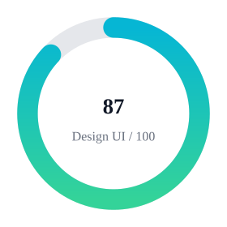
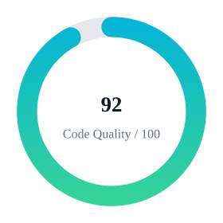
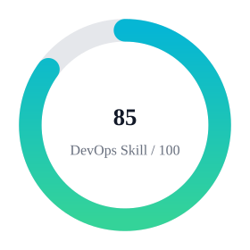
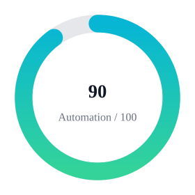

  

  
  
  

---

### 👤 Tentang Saya

* 🔭 Fokus sekarang: **Membangun bot Telegram & API untuk otomasi**
* 🧰 Stack harian: **Python | Docker | FastAPI | Redis | GitHub Actions | Nginx**
* 💬 Senang ngobrol soal: **DevOps, self-hosted tools, debugging Linux**
* ⚡ Fun fact: sering ngoprek server dari jam 12 sampe jam 5 pagi ☕
* 📫 Kontak cepat: **melalui GitHub issues/discussions** OR [EMAIL AKU](x866bash.github@zohomail.com)

---

## 🧩 Ringkasan & Metadata

<!-- METRICS:CARDS -->

---

## 🧠 Bahasa & Stack yang Dipakai

### 🔡 Bahasa Pemrograman

### 🧰 Alat & Platform

  
  
  
  
  
  
  

---

  
  
  
  

`███████████████████████████████████████████-----` 87/100

> **Nilai Awal** Set awal: `87`.

---

## 📊 Ringkasan Aktivitas (otomatis)

<!-- ACTIVITY:START -->

### Metrics

  

### Stats

  

### Bahasa

  

<!-- ACTIVITY:END -->

---

## 🗂️ Showcase Pilihan

- 🤖 [**DownloaderTera Bot**](https://github.com/x866bash/DownloaderTera) — Bot Telegram untuk download otomatis.
- 🔧 [**ApiRedis**](https://github.com/x866bash/ApiRedis) — API ringan berbasis Redis + Vercel.
- 🌐 [**x866bash.github.io**](https://github.com/x866bash/x866bash.github.io) — Website pribadi / portfolio.

---

<i>Made with ❤️  Profesional study.</i>

---

